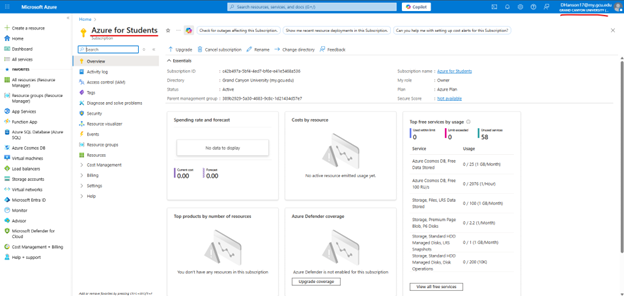
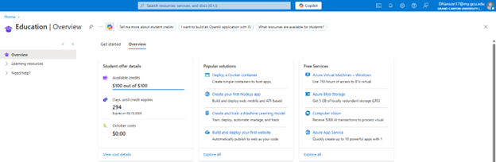

# CST 323 – Activity 2
**Name: Daniel Hanson**  
**Due Date: 2 November 2025**  
**Instructor: Professor Idahosa**

---

## 1. Screenshots of being logged into Azure Portal

---

## 2. Framework and Technology Chosen for the Test Application

**BSSD:**

`- Spring Boot`

`- Java 17`

`- MySQL` 

`- Thymeleaf` 

`- Bootstrap v5`

`- SLF4J/Logback`

`- GitHub`

---

## 3. Progress and Status of Database Designed for Test Application

**ER Diagram:**  

**Tables built:** 1 (`todo`)  
**Tables remaining:** 0

This table tracks todo objectives as part of a to-do tracker. It includes the following:
- A unique ID
- The description of the task
- Whether the task has been completed

---

## 4. List of Issues that are Ongoing and Hampering the Completion of Test Application

**Pages built:**
- `add-todo.html`
- `index.html`
- `todo-details.html`

**Pages remaining:** 0

**Services built:**
- `TodoService.java` — The service layer sits between the controller and the database layer. It’s the “brains” of the app.

**Remaining services:** 0

**Ongoing issues:** None

---

## 5. Screencast URL of Test Application Function Testability

- https://www.loom.com/share/6458d2c7006b4cdab4d746b65240f953

---

## 6. Cloud Computing Research Questions

**a. Evolution of the Cloud**  

The cloud has evolved significantly since 2009. 
In its early days, it was a misunderstood concept and not widely adopted 
except by mature companies like Salesforce.com. Many professionals believed
it was a passing trend. Over time, however, the scalability, cost savings,
and flexibility of cloud computing led to widespread adoption. By 2013, 
many businesses were moving to the cloud, paving the way for today’s 
extensive cloud integration. Today, cloud computing is widely seen as essential
for modern business operations. It's used to power everything from
startups to enterprises. 

---

**b. Case Study: _Instagram – From Zero to a Billion Overnight_**

This startup case study highlighted many advantages of leveraging cloud services.

### Advantages:
- **Financial Efficiency:** Instagram’s founders operated on a bootstrap budget, so using the cloud eliminated the need for costly physical servers.
- **Scalability:** The cloud allowed them to quickly scale up as millions of users joined — simply by increasing resources with a few clicks.
- **Focus on Core App:** Since the cloud handles infrastructure, the developers could focus on improving the app instead of managing data centers.

### Disadvantages:
- **Limited Control:** Outages (like AWS downtimes) could impact Instagram’s performance.
- **Unexpected Costs:** Rapid user growth could lead to rising storage and usage costs.
- **Security Risks:** Cloud-hosted data is accessible from anywhere, requiring strong compliance and security measures.

---

**c. My Choice: Cloud vs. On-Premise**  

If I were to choose between a cloud or on-premise solution, I would select **cloud-based infrastructure** based on flexibility, scalability, and pricing.

The cloud allows easy resource adjustments without purchasing or maintaining hardware. It also handles updates, security patches, and maintenance — saving time and money. Employees can securely access applications and data from anywhere, improving collaboration across multiple locations.

Overall, **cloud solutions** are a modern, affordable, and reliable choice for growing companies.

---

## Link to app:
- http://localhost:8080/
